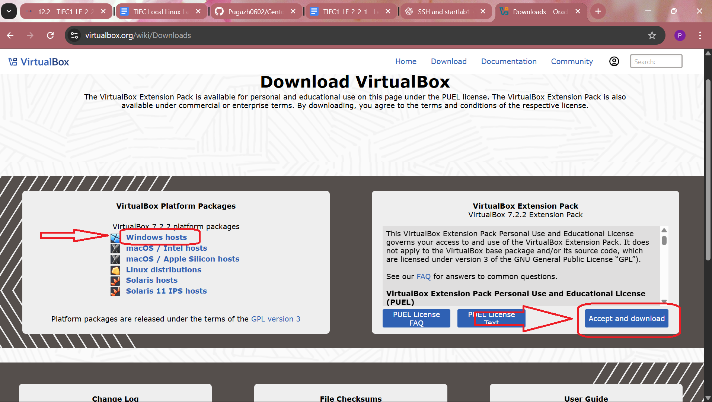
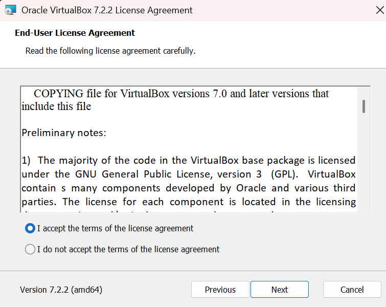
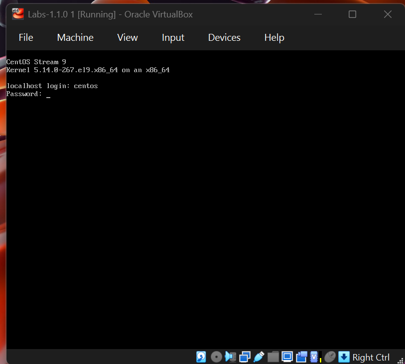

Step 1: Install VirtualBox according to your Operating System from Url:https://www.virtualbox.org/wiki/Downloads

Download VirtualBox Platform Packages \& VirtualBox Extension Pack 

Step 2: Download Centos from Url:https://drive.google.com/file/d/1QXdagFhT5kchGL-iLlDSkcN2RqIskLmX/view or Url:https://www.centos.org/download/

Step 3: Extract the Centos Iso \& Double Click the Iso file. The VM will automatically run the Centos.

Step 4: Enter "centos" for LocalHost login and password.

Step 5: Open terminal by Right clicking in desktop or search "terminal" in windows search.

Step 6: Type the following commands 

'''

\#Note 

&nbsp;	#If you see somthing like "lines 1-20/20 (END)" Press " q "

\#connect to VM centos From windows terminal 

ssh centos@localhost

\#password 

centos

\#Start the Lab Environment 

startlab1

\#Install Httpd 

sudo yum install httpd -y

\#Check if httpd is installed

sudo systemctl status httpd

\# Stop firewall temporarily (so Windows can access Apache Server )

sudo systemctl stop firewalld

\# Start Apache (httpd) Service

sudo systemctl start httpd

\# Enable Apache to start on boot (Optional)

sudo systemctl enable httpd

This makes Apache start on every boot.

# ***Check status***

sudo systemctl status httpd

You should see:

Active: active (running)

Step 7: Open your Windows browser and go to:**http://localhost:8080/**

'''

**Congratulations you  have successfully started the server.**

