# ***Server Setup in Linux***

**Step 1: Install VirtualBox according to your Operating System from Url:https://www.virtualbox.org/wiki/Downloads**
---
Download VirtualBox Platform Packages \& VirtualBox Extension Pack 


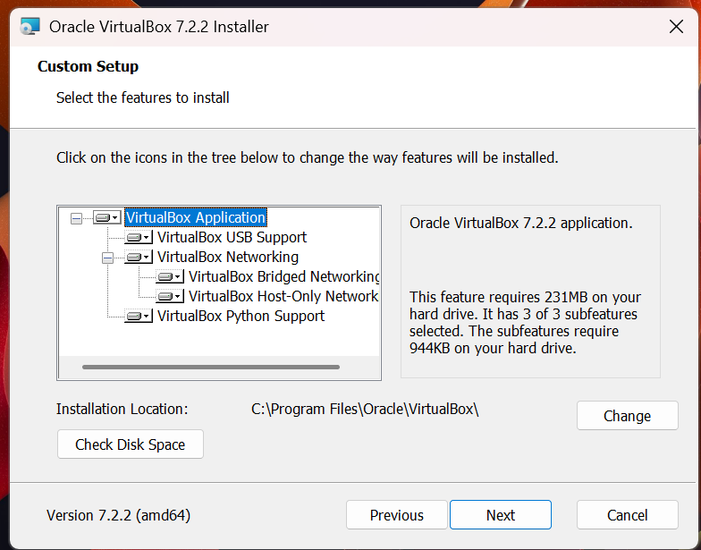

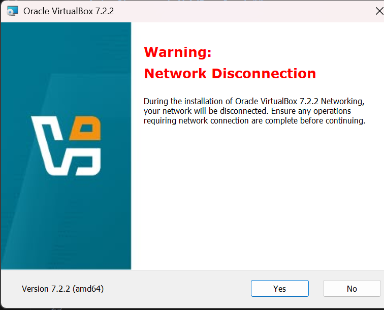


---
**Step 2: Download Centos from Url:https://drive.google.com/file/d/1QXdagFhT5kchGL-iLlDSkcN2RqIskLmX/view or Url:https://www.centos.org/download/**

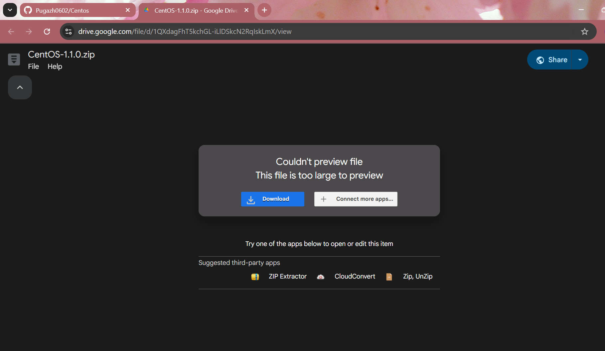
---
**Step 3: Extract the Centos Iso \& Double Click the Iso file. The VM will automatically run the Centos.**
---

---

---

---
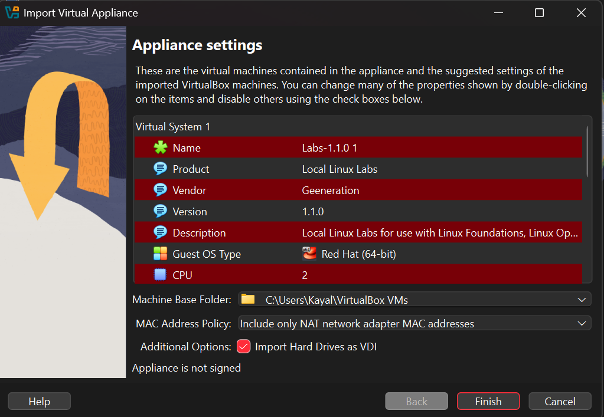
---
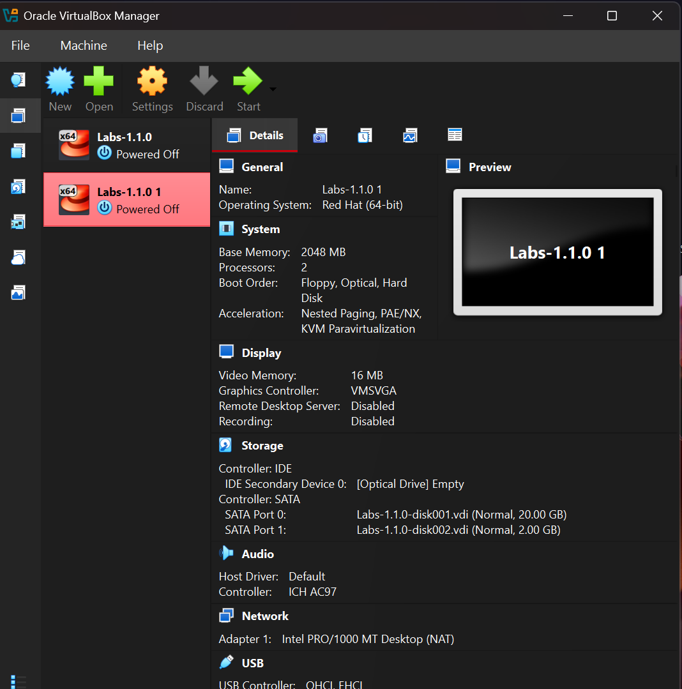
---
***Step 4: Setup network in VM Box and Starting centos***
---
**Open Settings**
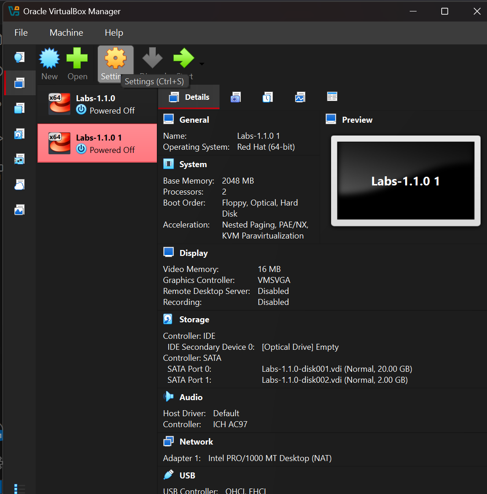
---
**Open network settings**

---
**Click Port Forwarding**

---
**Set http values as shown in the Image**
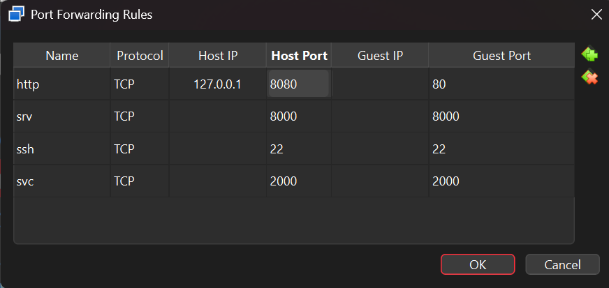
---
**Click Start**
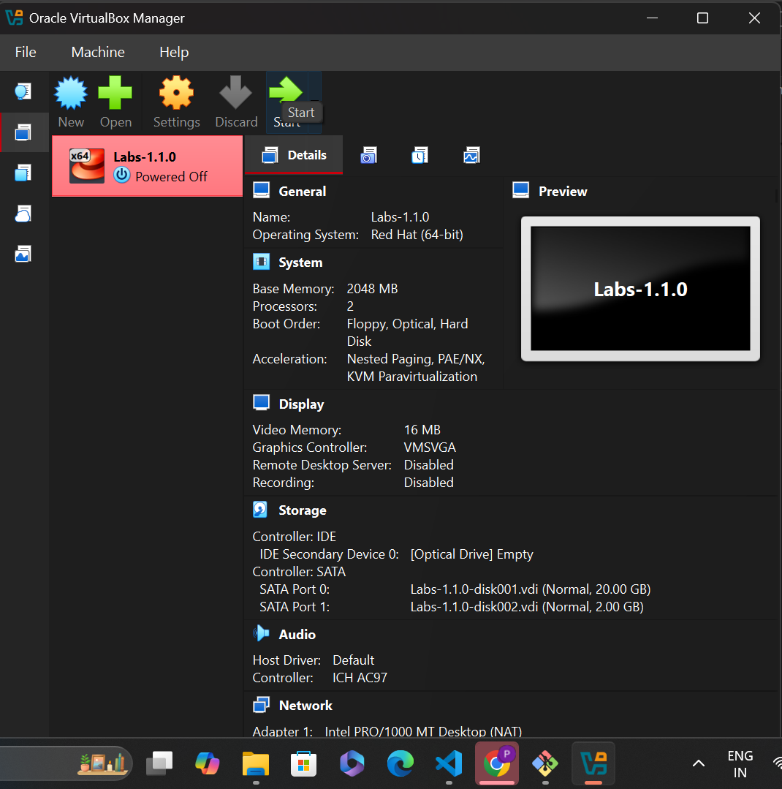
---

**Step 5: Enter "centos" for LocalHost login and password.**
---

---

**Step 6: Open terminal or Command prompt by Right clicking in desktop or search "terminal" or "CMD" in windows search.**
---


---
**Step 7: Type the following commands**
---


# ***Note***

   ***If you see "lines 1-20/20 (END)" Press " q "***
   ***This Exit the log***
---


***Connect to VM centos From windows terminal***
---
```sh
ssh centos@localhost
```
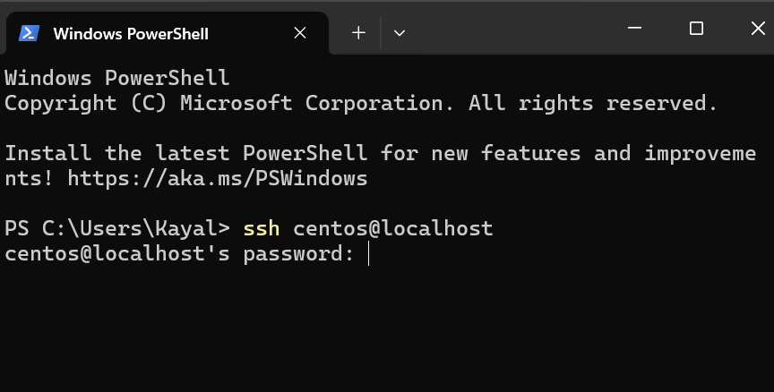
---
***Password*** 
---
```sh
centos
```
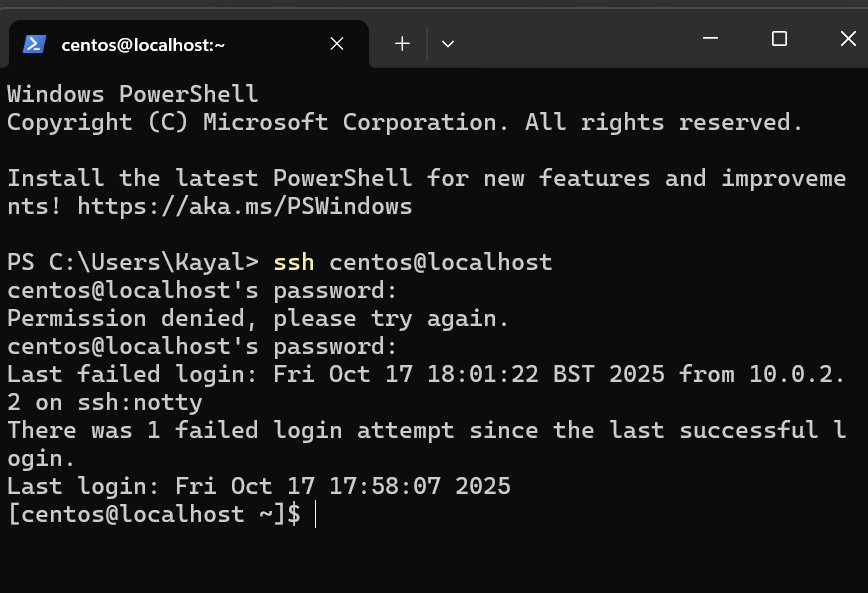
---
***Start the Lab Environment*** 
---
```sh
startlab1
```

---

***Check if httpd is installed***
---
```sh
sudo systemctl status httpd
```
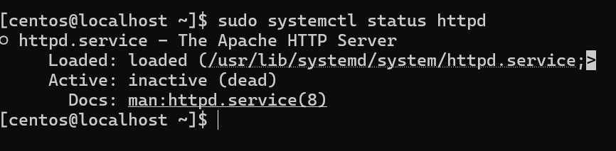
**Press q to Exit Log**
---

***Install Httpd(If not installed)***
---
```sh
sudo yum install httpd -y
```

***Stop firewall temporarily (so Windows can access Apache Server )***
---
```sh
sudo systemctl stop firewalld
```


***Start Apache (httpd) Service***
---
```sh
sudo systemctl start httpd
```
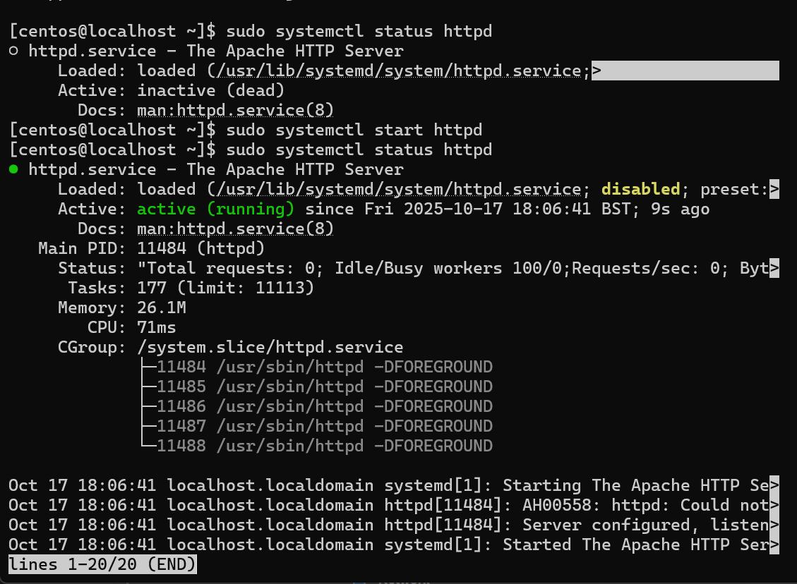

***Press q to Exit Log***
---

***Enable Apache to start on boot (Optional).***
***This makes Apache start on every boot.***
---
```sh
sudo systemctl enable httpd
```
***Check status***
---
```sh
sudo systemctl status httpd
```

---

***You should see:***
***Active: active (running)***
---

**Step 8: Open your Windows browser and go to:**
---
```sh
http://localhost:8080/
```

---


**Congratulations you  have successfully started the server.**
===


